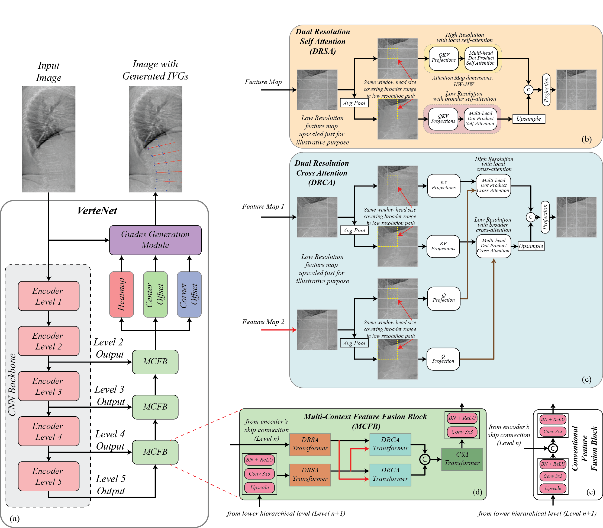

# VerteNet
A PyTorch implementation of VerteNet for vertebral landmarks localization in lateral view DXA images.


## Dataset
Custom dataset was used for the training of this model which has not been shared due to data ethics limitations. 
For training, testing, and prediction using VerteNet, make sure the directory like this:
```                           
|-- datapath     
    |-- data
        |--train
        |--test
        |--val        
    |--labels
        |--train
        |--val  
```
